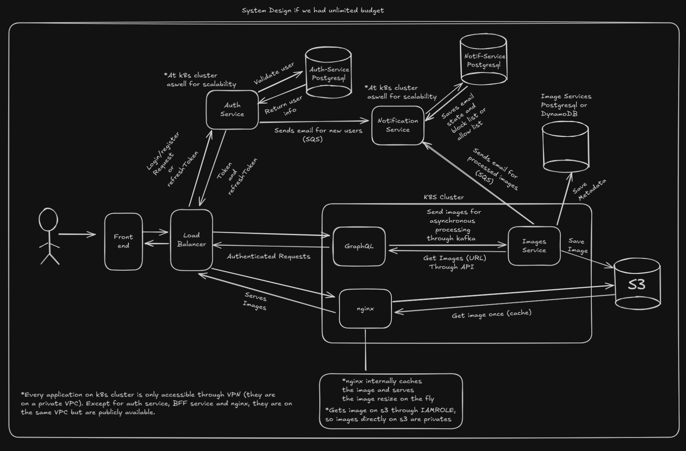

# image-processing-with-authentication-microsservices

## How to properly start the project

Requirements

- [Minikube](https://minikube.sigs.k8s.io/docs/start/?arch=%2Flinux%2Fx86-64%2Fstable%2Fbinary+download)
- [Kubectl](https://kubernetes.io/docs/setup/)
- [Docker](https://www.docker.com/)
- [awslocal-cli](https://github.com/localstack/awscli-local)
- [Node 22](https://nodejs.org/en/download/current/) (Front-end)
- Make
- Java 21 (Back-end)

Now, let's get into the fun part!

Start your minikube environment:
```sh
$ minikube start
```

Redirect your docker to use minikube docker system
```sh
$ eval $(minikube docker-env)
```

## Building Auth Service and Adding it to Minikube cluster
Go to `auth` folder and execute `make build/docker`. This command executes respectively `./gradlew clean`, `gradlew build` (while also checking for format issues) and `docker build -t name/image-name:latest`.

Docker should be loaded into `Minikube`. We can check by executing:
```sh
$ docker ps -a
```

After we are sure that the docker image is loaded into `Minikube`, we can now deploy it by executing:
```sh
$ kubectl apply -f deployment/deploy.yaml
```

Now we can execute the following command to check if it is executing:
```sh
$ kubectl get pods | grep "auth"
```
It should now list that `auth-service-a-lot-of-number-and-letters-here` is running.

Well, the application is running, is it ready? No. it is not accessible to your host nor they can't see each other, in order to do that, we must do the following command:
```sh
$ kubectl apply deployment/service.yaml
```

Now we can execute the following command to check if it is executing:
```sh
$ kubectl get services | grep "auth"
```
It should not list that `auth-service` have a NodePort. Now it is visible to your host and each other application.

Now we need to grab the service ip to have access. In order to do that we must execute:
```sh
$ minikube service auth-service --url
```
It should spit out in the terminal something like `http://192.168.49.2:30080`. We should use this IP to communicate with the service. It is now correctly up and running.

## Building Bff Service and Adding it to Minikube cluster
Go to `bff` folder and execute `make build/docker`. This command executes respectively `./gradlew clean`, `gradlew build` (while also checking for format issues) and `docker build -t name/image-name:latest`.

Docker should be loaded into `Minikube`. We can check by executing:
```sh
$ docker ps -a
```

After we are sure that the docker image is loaded into `Minikube`, we can now deploy it by executing:
```sh
$ kubectl apply -f deployment/deploy.yaml
```

Now we can execute the following command to check if it is executing:
```sh
$ kubectl get pods | grep "bff"
```
It should now list that `bff-service-a-lot-of-number-and-letters-here` is running.

Well, the application is running, is it ready? No. it is not accessible to your host nor they can't see each other, in order to do that, we must do the following command:
```sh
$ kubectl apply deployment/service.yaml
```

Now we can execute the following command to check if it is executing:
```sh
$ kubectl get services | grep "bff"
```
It should not list that `bff-service` have a NodePort. Now it is visible to your host and each other application.

Now we need to grab the service ip to have access. In order to do that we must execute:
```sh
$ minikube service bff-service --url
```
It should spit out in the terminal something like `http://192.168.49.2:30081`. We should use this IP to communicate with the service. It is now correctly up and running.

## Building Image service Service and Adding it to Minikube cluster
Go to `imageservice` folder and execute `make build/docker`. This command executes respectively `./gradlew clean`, `gradlew build` (while also checking for format issues) and `docker build -t name/image-name:latest`.

Docker should be loaded into `Minikube`. We can check by executing:
```sh
$ docker ps -a
```

After we are sure that the docker image is loaded into `Minikube`, we can now deploy it by executing:
```sh
$ kubectl apply -f deployment/deploy.yaml
```

Now we can execute the following command to check if it is executing:
```sh
$ kubectl get pods | grep "images-service"
```
It should now list that `images-service-a-lot-of-number-and-letters-here` is running.

Well, the application is running, is it ready? No. it is not accessible to your host nor they can't see each other, in order to do that, we must do the following command:
```sh
$ kubectl apply deployment/service.yaml
```

Now we can execute the following command to check if it is executing:
```sh
$ kubectl get services | grep "images-service"
```
It should not list that `images-service` have a NodePort. Now it is visible to your host and each other application.

Now we need to grab the service ip to have access. In order to do that we must execute:
```sh
$ minikube service images-service --url
```
It should spit out in the terminal something like `http://192.168.49.2:30082`. We should use this IP to communicate with the service. It is now correctly up and running.

## Making our infraestructure online
Go to `infra` folder and execute the following command:
```sh
$ docker compose up -d
```

Now we need to set up `kafka`, `localstack` and `postgres` service to be visible from minikube cluster perspective:
```sh
$ kubectl apply -f deployment/kafka_deployment.yaml && kubectl apply -f deployment/localstack_deployment.yaml && kubectl apply -f deployment/postgres_deploymeny.yaml
```

That's it!

## System Design
Now, reinforcing, this is just an apresentation project. The current system design is at it follows:


Now, if we had unlimited budget:


